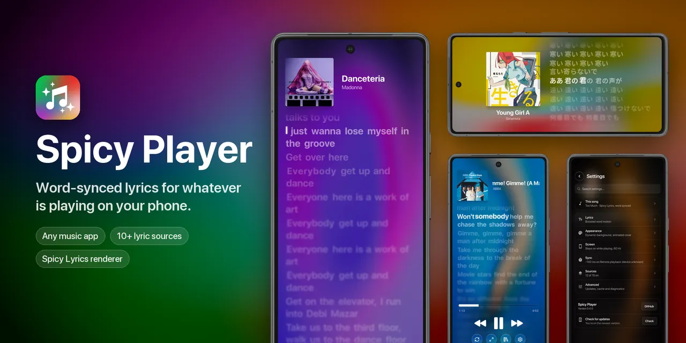

# Spicy Player

> [!NOTE]
> **Looking for the offline music player?** The earlier Spicy Player, which plays your own music files, now lives at [Spicy Player (old)](https://github.com/TheX24/spicy-player-old). It is no longer developed.

An Android lyrics screen for music playing in another app. It follows the active Android media session, fetches timed lyrics from online sources, and shows playback controls when the music app supports them. It has no local music library or playback service. It succeeds the [original Spicy Player](https://github.com/TheX24/spicy-player-old), an offline music player.

**Status:** early development. The interface and provider availability may change. Releases are prereleases; check their notes before installing.

## Try it

1. Install an APK from [Releases](https://github.com/TheX24/spicy-player/releases), or build one below. After that, the app offers new versions itself when you open it; "Check for updates" at the bottom of Settings looks right away.

   Google Play Protect may block the APK when you open it from a browser or file manager, because the app asks for notification access. Installing through [Obtainium](https://obtainium.imranr.dev/) is an alternative ([add Spicy Player to Obtainium](https://apps.obtainium.imranr.dev/redirect?r=obtainium://app/%7B%22id%22%3A%22com.tx24.spicyplayer.next%22%2C%22url%22%3A%22https%3A%2F%2Fgithub.com%2FTheX24%2Fspicy-player%22%2C%22author%22%3A%22TheX24%22%2C%22name%22%3A%22Spicy%20Player%22%2C%22preferredApkIndex%22%3A0%2C%22additionalSettings%22%3A%22%7B%5C%22includePrereleases%5C%22%3A%20true%7D%22%7D)). It installs the same signed APK from Releases and handles updates.
2. Open the app and grant notification access when prompted. Android uses this permission to let the app discover active media sessions. You can revoke it in system settings.
3. Start music in another app, then return to the lyrics app. It should follow the active player and look up lyrics.
4. Use Settings to adjust lyric sources, timing, or an optional Spicy Lyrics client key. Settings → Advanced → Last lookup shows what each source returned for the current song.
5. Optional, but worth it: get your own free Spicy Lyrics key. The built-in key is shared by everyone and runs out when many people use the app at once. Open [Spicy Player in the Spicy Lyrics catalog](https://developers.spicylyrics.org/catalog/spicy-player), sign in, tap **Add**, and paste the client key into Settings → Sources → Spicy Lyrics key. Your key has its own rate limit and doesn't use one of your application slots.

Playback controls depend on what the music app exposes through Android MediaSession. Some apps or account tiers limit seek and skip; the app explains when Spotify Free refuses one. Lyrics depend on the source having a usable match; a missing or uncertain Spotify match is not silently replaced with a different recording.

## Bugs, ideas, and contributions

Found a bug or have an idea? [Report a bug or suggest a feature](https://github.com/TheX24/Spicy-Player/issues/new/choose), or post in the [Spicy Player thread](https://discord.com/channels/1369992682214264993/1555941028622770337) on the [Spicy Lyrics Discord](https://discord.com/invite/uqgXU5wh8j) (join first, then the thread link works). Both are linked from the version card in Settings. Include your app version, phone/Android version, music app, and steps to reproduce a bug; screenshots and song links help.

If Spicy Player is useful to you, a star on the [repository](https://github.com/TheX24/spicy-player) helps other people find it. The "Star on GitHub" button in Settings opens it.

See [CONTRIBUTING.md](CONTRIBUTING.md) for reports and pull requests, and [SECURITY.md](SECURITY.md) for private vulnerability reporting. Remove keys and private information before sharing diagnostics.

## Battery and performance

The app is fully native (Kotlin and Jetpack Compose, no WebView), and it only works while you can see it. Measured on a Pixel 7 with the power rails built into the phone:

- **In the background: under 1% of one CPU core.** With the screen off, or with another app open, it only listens for song changes.
- **While showing lyrics: about 0.34 W more than the home screen**, roughly 2% of the battery per hour on top of what the screen costs anyway.
- **Smooth: 1 janky frame in 5,600** at 90 Hz. The 90 Hz mode (Settings → Device → Smoother motion) adds only about 0.05 W.

Your numbers will differ with your phone, the brightness and the background you choose. Settings → Device → Low performance mode turns off the most expensive effects.

## Privacy

### Lyrics lookups

Out of the box, Spicy Player asks [Spicy Lyrics](https://spicylyrics.org) for lyrics, then the lyrics services whose public APIs say any app may use them: [LRCLIB](https://lrclib.net) (the song's title, artist, album and length), [AMLL TTML DB](https://github.com/amll-dev/amll-ttml-db) (title and artist), [LRCMux](https://lrcmux.dev) (title, artist and length), [lrc.red](https://lrc.red) (title and artist) and [BiniLyrics](https://lyrics.binimum.org) (title, artist and length). To find a song on Spicy Lyrics, it first matches it to a Spotify track: it searches Spotify, without an account, for the song's title, artist, album and length. On Android 13 and newer, the moving background also asks Spotify for the track's beats (Settings → Background → Move with the Music turns that off).

Every other lyrics source (Unison, QQ Music, NetEase, Kugou, Kuwo, RMM Revival, Genius, YouTube transcripts) is off until you switch it on in Settings → Sources. Before one is switched on for the first time, the app says who it asks and what it sends: the song's title and artist, and for some, its album or length. The same goes for human romanizations, which ask Genius. No account or device details go to any of them. Release year and animated covers, which ask Spotify and Apple's iTunes search, are off by default too.

### Usage stats

Release builds send anonymous usage stats to the project's own [Umami](https://umami.is) server, so we can see how many people use the app and which features are worth working on. The app asks once when it first opens (new installs and updates alike). Nothing is sent before you answer, and you can turn it off any time in Settings → Advanced → Privacy. Debug builds, and builds made without the project's `UMAMI_WEBSITE_ID`, never send anything.

**Never sent:** what you listen to (song titles, artists, albums, lyrics), anything else from the music app's notification, text you type, keys, account details, Android ID or advertising ID.

**What is sent:**

- **With every report:** a random ID made when the app is installed, used only to count installs; the app version; Android version; phone model; language; screen size in dp; phone or tablet. Umami works out your country from your IP address and does not store the address.
- **When the app opens** (at most every 6 hours): whether you get pre-release updates.
- **Once a day, the settings you use:** each appearance, scroll, background, header, controls, theme (settings, pop-ups, app icon) and haptics setting, as its option name or on/off. For a custom font, only "Custom" is sent, never the font's name. From the lookup settings: which source comes first, how many sources are off, how many blends are on, the romanization and LRCMux word-sync switches, whether you use your own Spicy Lyrics key (yes or no, never the key), and how many custom sources you have (never their names, addresses or headers).
- **Counts since the last report** (sent with app opens, at most every 6 hours): how many songs were looked up and how many got word-synced, line-synced, plain or no lyrics; which lyrics source and which music app (by package name, e.g. `com.spotify.music`) were used most, with counts for the top sources (a custom source counts as "Custom"); how often settings, each settings page, quick settings, the queue, the Lyrics Manager and Spotify search were opened; how often romanization was toggled, the expand button and the player's own buttons were tapped, lyrics were resynced, delay calibration was started, and settings were backed up or restored.

The counts are kept on your phone until the next report. Turning the setting off deletes the install ID and any counts not yet sent; turning it back on starts with a new ID. The answer stays on the device: it is not part of a settings backup.

## Build from source

You need JDK 17 or newer and the Android SDK for API 37. Android Studio can install both. `local.properties` may point to your SDK; it is ignored by Git.

On Windows, from the repository root:

```powershell
.\gradlew.bat assembleDebug testDebugUnitTest lintDebug
```

On macOS or Linux, run `./gradlew assembleDebug testDebugUnitTest lintDebug`. The APK is `app/build/outputs/apk/debug/app-debug.apk`; install it with `adb install -r` or Android Studio. The application ID is `com.tx24.spicyplayer.next`; debug builds install next to it as `com.tx24.spicyplayer.next.debug` ("Spicy Player Debug").

The Spicy Lyrics provider needs a publishable `sl_pk_` client key. To include one in your own build, copy `.env.example` to `.env` and set `SPICY_LYRICS_CLIENT_KEY`. You may also enter your own key in the app’s Settings. The file is ignored by Git, but **the value is embedded in the APK**. Never use an `sl_sk_` secret key. Other sources can still be used when this key is blank.

`UMAMI_WEBSITE_ID` in the same file turns on the usage stats described under [Privacy](#privacy) in release builds. Leave it blank in your own builds unless you run your own Umami site.

## Releases and CI

Pull requests and pushes to `main` or `dev` build a debug APK, run unit tests and lint, and retain the APK as a short-lived Actions artifact. These builds use no repository secrets.

An intentional `v<versionName>` tag starts the prerelease workflow. It checks the Gradle version, builds a signed release APK with the repository's publishable Spicy Lyrics client key, verifies its signature, and uploads the APK plus SHA-256 digest to GitHub Releases. The tag must identify the commit being released. See [release instructions](docs/releases.md) for signing setup and the release checklist. Debug builds are a separate app (`.debug`), so they never replace an installed release.

## Current limits

- The settings screen still includes developer-oriented source and matching controls.
- Judge smoothness on a release build (`assembleRelease`): debug builds are unoptimised and noticeably slower.
- This app needs notification access to follow another player; it does not play local files itself.
- The controls report Android media-session acknowledgement, which is not a measurement of audible response time.
- Source preferences, manual Spotify-ID overrides, and cached lyrics are stored locally. Android backup is disabled.

## License and attribution

Spicy Player is licensed under the [GNU Affero General Public License, version 3](LICENSE). Its lyrics renderer is adapted from [Spicy Lyrics](https://github.com/Spikerko/spicy-lyrics), its source fetching and blends from [mild-lyrics](https://github.com/gcoolL/mild-lyrics), and more comes from other open-source projects. Lyrics come from Spicy Lyrics, [LRCLIB](https://lrclib.net), the [AMLL TTML DB](https://github.com/amll-dev/amll-ttml-db) (CC0), [LRCMux](https://lrcmux.dev), [lrc.red](https://lrc.red) and [BiniLyrics](https://lyrics.binimum.org), plus any sources you switch on. [THIRD_PARTY_NOTICES.md](THIRD_PARTY_NOTICES.md) lists them all with their licenses.
